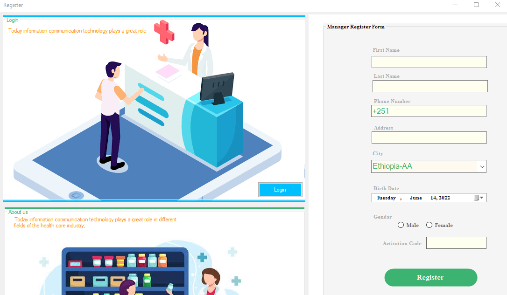
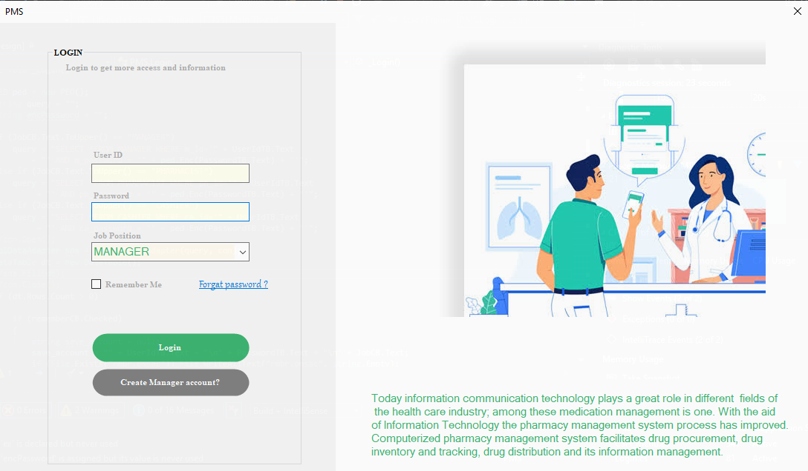
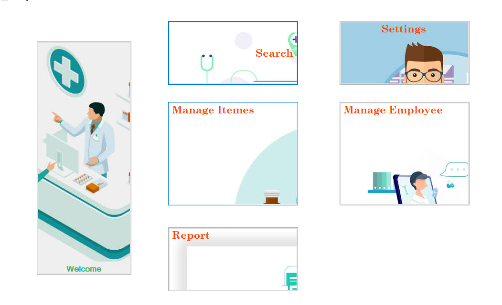
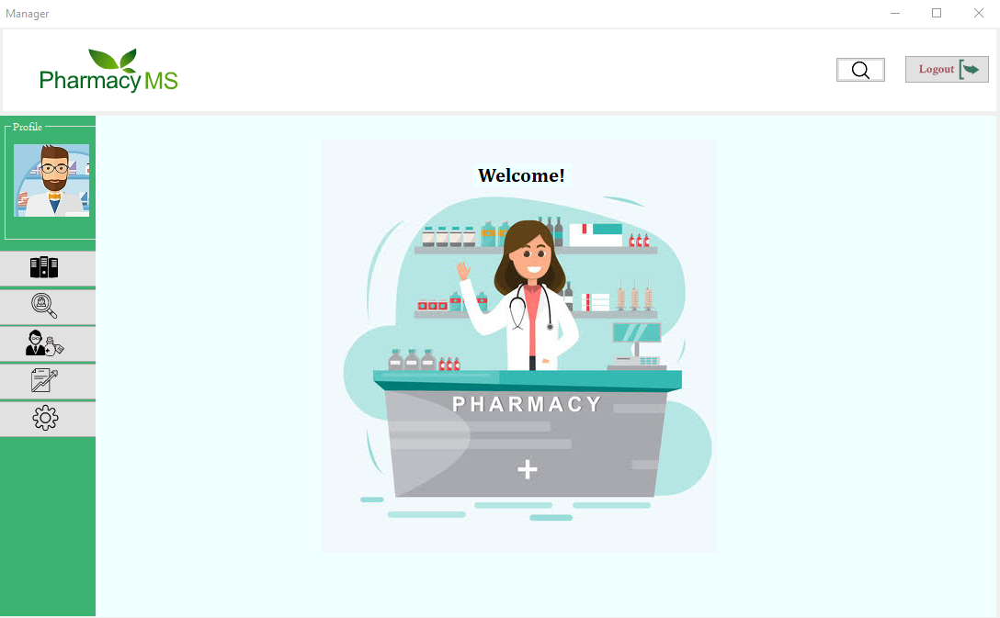
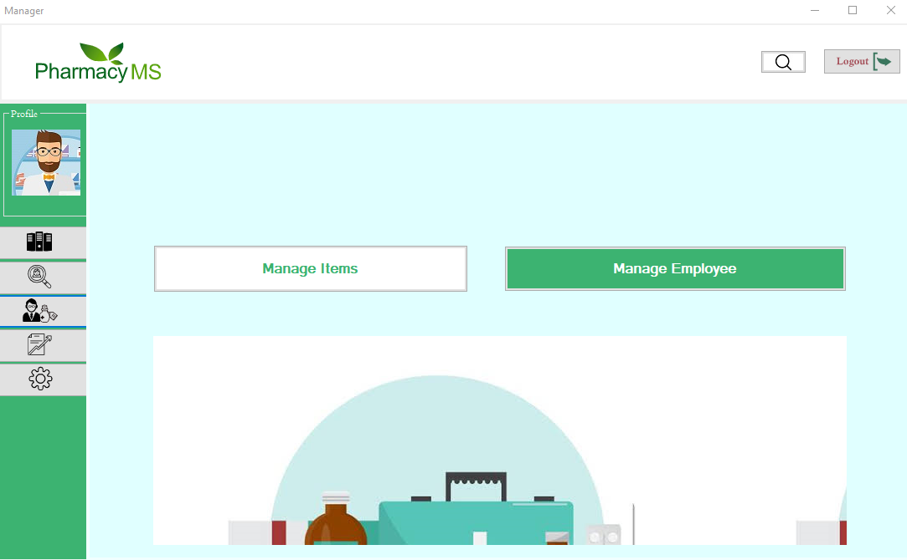
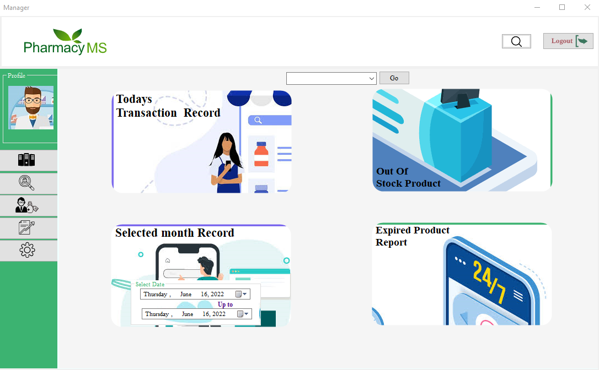

# Pharmacy Management System (Desktop Application)

---

## Overview
The **Pharmacy Management System** is a **desktop-based application** developed with C# (.NET Framework) designed to improve **accuracy, efficiency, and safety** in pharmaceutical stores.  
It automates inventory management, stock control, prescription handling, and reporting, reducing manual errors and optimizing workflow.

---

## Features
- Real-time inventory tracking
- Alerts for low stock and expiring drugs
- Role-based access control (pharmacist, admin)
- Sales tracking and reporting
- Multi-user support
- User-friendly desktop interface
- Reduced paperwork and manual errors

---

## Technologies Used
**Frontend:** .NET Framework (C# Desktop Application)  
**Database:** Microsoft SQL Server  
**Languages:** C#, JavaScript  
**Development Tools:** Visual Studio, NetBeans (for Java utilities if needed), SQL Server Management Studio  

---

## User Manual
A detailed **User Manual** is available for the Pharmacy Management System, which provides instructions on installation, usage, and troubleshooting.  

[Download User Manual](doc/Manager_manual.pdf)
[Download User Manual](doc/CashierManual.pdf)
[Download User Manual](doc/PharmacistManual.pdf)

---

## Screenshots
Here are sample screenshots of the system:

  
  
  
  
  
  
  

---

## Project Structure
